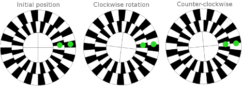
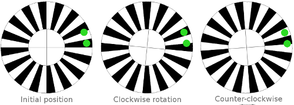
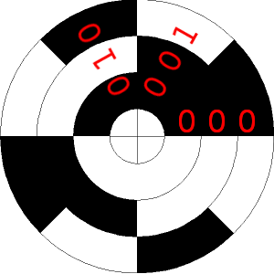
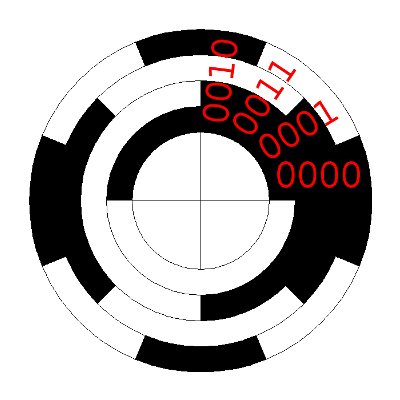

# Encoder Reference

WheelEncoderGenerator creates an encoder disc with a pattern on it that is read by one or more reflectance sensors that shine a light on a small area of the encoder disc, generating a voltage proportional to how much light is reflected by the area under the sensor. 

The voltage can be converted into a digital signal for interfacing with a microcontroller or other hardware.

Software, firmware or circuits can be configured to detect the signal changes from each sensor to detect angular rotation and speed of rotation.

Depending on the type of encoder and sensor arrangement, signals generated can indicate direction of rotation and absolute position. But more on this as we talk about each of the encoder types.

## Quadrature Encoder

This type of encoder detects rotation and the direction of rotation. The encoder disc contains two tracks with the same number of black and white stripes and an optional Index Track (covered below). The position of the stripes on the inner track are rotate relative to the outer track.

The reason for the rotation is so that two sensors positioned along a *radial* line from the shaft, shown by the green dots above, will generate signals that are 90 degrees *out of phase*. When one sensor is squarely on a stripe, the other is halfway between stripes. The phase indicates direction of rotation and is easily detected in software or hardware.

As you no doubt expected, the speed of rotation determines the frequency of pulses.

Exercise for the reader: could we use inner and outer stripes that are 180 degrees out of phase and why or why not? What about a phase difference of 23.4?

## Simple Encoder

A simple encoder contains one track with the same number of black and white stripes and an optional Index Track (covered below). If you're sure your motor, wheel, or whatever only rotates in one direction (or don't care if it doesn't), you can use this encoder type and a single sensor.

It's worth mentioning that you can still use this type to build a quadrature encoder system. Instead of two sensors along a radial line, place two sensors on a circumference smaller than that of the encoder. Like this:

## Index Track

Quadrature and simple encoders don't report absolute shaft position but an index track, which contains a single narrow stripe, can act as a "home position" indicator.

## Binary Encoder
This is a type of absolute position encoder consisting of multiple tracks. It converts the *position* of the encoder disc into a binary number. 

The number of unique positions is given by **2R** where **R** is the number of encoder tracks. In the example above with 3 tracks, the encoder can detect 8 unique positions. 

As the encoder above rotates clockwise, the sensor output will read 000, 001, then 010, counting up in binary from decimal 0-7.

Starting with the outermost track, binary encoders have 2R stripes, half black, half white. The next inner track has half as many stripes, and so on until you get to the innermost track which has 2 stripes, 1 white, 1 black.

## Gray Code Encoders

Gray Code encoders are exactly like Binary Encoders differing only in the rotation of each track, which produces a sequence of binary numbers in *Gray Code.* 

But first, what is *Gray Code*?

Gray code is named after Frank Gray and is a binary numeral system where only one bit differs between successive numbers. It's also known as the *reflected binary code.*

When used in absolute position encoders, Gray Code ensures that each successive position is represented by a data word differing in only one bit. For example, with a two-bit encoder, the data words are 00, 01, 11, 10.

In a rotary encoder, it's useful that the first and last numbers in the sequence (00, 10) differ by only one bit as well. Also, if your sensor is right on the border between two positions, the maximum possible error is one bit, or one position, a feature Gray Code has over Binary Coding.

A three-bit Gray Code sequence is: 000, 001, 011, 010, 110, 111, 101, 100. A four-bit sequence takes the 3-bit sequence and reflects it. The old sequence gets a 0 added to the front and the new, reflected sequence gets a 1 added to the front: 0000, 0001, 0011, 0010, 0110, 0111, 0101, 0100, 1100, 1101, 1111, 1110, 1011, 1001, 1000. With black representing 0 and white representing 1, the example below illustrates a 4-bit Gray Code absolute encoder.