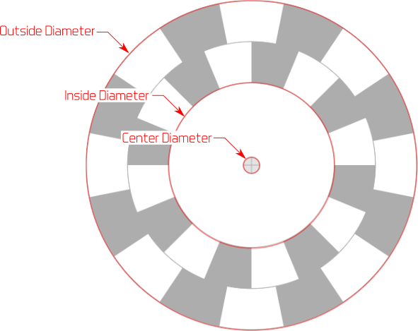

# Settings

This is the settings pane. Read on for more details about each of these settings.

## Encoder Type

First, what kind of encoder do you want? Make your selection in the `Encoder Type` pulldown menu.

You have these options:

 * **Quadrature**: used to detect forward/reverse motion
 * **Simple**: detects motion (and, potentially, direction)
 * **Binary**: detects motion and absolute position
 * **Gray**: same as binary, except only one bit changes at a time
 
For more details on these encoder types, see [Encoder Reference](EncoderRef.md)

## Resolution

Specify the encoder resolution in the `Resolution` field.

**Quadrature and Simple Encoder types:** the resolution corresponds to the number of black stripes on the outer track. The value can range from 1 to 512. A resolution of `1` has 1 black and 1 white stripe while a resolution of `16` has 16 black stripes and 16 white stripes.

**Binary and Gray Encoder types:** the resolution corresponds to the number of tracks on the encoder. The number of unique positions the encoder can detect is equal to **2R** where **R** is resolution. So an encoder with a resolution of 4 (bits) has 16 unique positions. The values can range from 1 bit (2 positions) to 11 bits (2048 positions).

## Units

Before you specify the dimensions of the encoder, you probably want to specify which units to use.

You can select `mm` or `inches` from the `Units` pulldown menu. When you make a change, the current dimensions are automatically converted to the new units.

## Encoder Diameters

The three encoder disc dimensions you can adjust are shown below.

**Outer Diameter**. You can specify the outer diameter of the encoder disc in the`Outer Diameter` field. 

*Note: Must be larger than the inner diameter and the center diameter otherwise an error is indicated with a red outline on the text field and the design is invalid.*

**Inner Diameter**. The `Inner Diameter` field refers to the inner diameter of the innermost encoder track. 

*Note: Must be smaller than the outer diameter and larger than or equal to the center diameter otherwise an error is indicated with a red outline on the text field and the design is invalid.*

**Center Diameter**. Your encoder has to be mounted on some kind of shaft or axle, and so it needs a hole in the center. Specify the diameter of this axle shaft hole with the `Center Diameter` field. 

*Note: Must be less than or equal to inner diameter and less than outer diameter otherwise an error is indicated with a red outline on the text field and the design is invalid.*

If the encoder dimensions are invalid, the encoder can't be saved or printed until you fix the problem.

### Inverted

Click the `Inverted` toggle to swap the black and white colors on your encoder design.

### Direction: Clockwise or Counter-Clockwise

*Note: This setting doesn't make sense for a Simple Encoder, so it is disabled for that type.*

You can specify the direction your encoder rotation by clicking the `CW`(clockwise) or `CCW` (counter-clockwise) buttons next to the `Direction` label.

Why is this useful? Suppose you have an autonomous RC car. Each wheel encoder rotates in opposite directions. For each to generate the same signal pattern (and thus use the same code), one wheel has to be designed for clockwise and the other for counter-clockwise rotation.

In this case, after designing an encoder for the left side (American driver's side) to rotate clockwise, click the `CW` button, print it. For the right (Amercan passenger's side) wheel, simply click the `CCW` button and print the encoder again.

### Index Track

*Note: This setting only makes sense for Quadrature and Simple encoders and is disabled for the Binary and Gray encoders.*

The purpose of an index track is to identify a starting point in rotation. The index track has only one black stripe, of the same angular size as the stripes on the outer track.