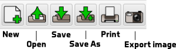

# Toolbar

The following sections provide additional detail about how to use the toolbar functions, shown below.

## New

If you'd like to start over with a new encoder design, click the `New` button. You'll be asked to save any unsaved changes. See **Unsaved Changes** below.

A new encoder with default settings will be display.

## Open

To open a previously saved encoder, click the `Open` button. You'll be asked to save any unsaved changes. See **Unsaved Changes** below.

A file chooser dialog appears. Find the directory / folder where the encoder file is located, select the file, and click `Open`.

## Save

To save your encoder, click the `Save` button. If it's the first time you've saved the encoder, a dialog will open and you'll be prompted for a file location and file name and you'll need to click the `Save` button on the dialog window.

If you've already saved the file previously, clicking the `Save` button will simply save the file.

How do you know if your encoder design has changed since last saved or opened? Look at the title bar. If the filename has a '*' following it, then the most recent changes have *not* been saved.

## Save As

If you'd like to save the current encoder as a new file, click the `Save As` button. A file chooser dialog appears. Find and open the directory you'd like to save the file to, enter the new file name, and click `Save`.

## Print

To print out your encoder, click the `Print` button. You'll be presented a platform-specific print dialog. Select your printer and other settings, and click `Print` (or equivalent button).

## Export

By clicking on the `Export` button, you can take a snapshot of the current encoder preview and save it as a PNG (Portable Network Graphics) file.

Just click the `Export` button, choose where to save the image, enter a filename, and click the `Save` button.

## Unsaved changes?

If your current encoder hasn't been saved you'll be asked if you want to save it or not. Click `Yes` to save it (you will be prompted as if you had clicked `Save As`. See: **Save the current encoder into a new file**, above), `No` to discard changes, and `Cancel` to cancel whatever operation is in progress (either New, Open, or Quit/Exit).

