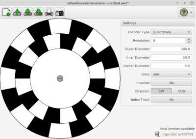
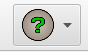
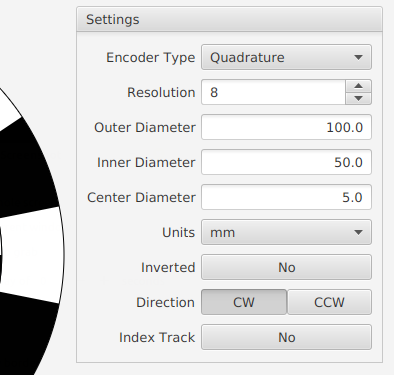

# A Quick Tour of the Application

After you launch the application you should see this:

On the left is the encoder disc preview, as you probably guessed. The settings are inside a pane on the right. The toolbar is across the top. Finally, if a new version is available, you'll see a notification in the lower right of the application.

## Toolbar

The toolbar at the top has buttons to open and save files, print and export your design, get help, and more.

For more details on each of these features, see [Toolbar](Toolbar.md)

## Help and About

To view this online help in the application, click the help icon (shown below) found in the upper right and select `Help`. 

To see information about the application, click the help icon and select `About`.

## Settings

To make changes to your encoder design, you'll use the controls under the `Settings` pane on the right side of the application window (see picture above and below).

See [Settings](Settings.md) for more details on each of the available options.

## Quitting the application

To quit the application simply close the application window. You'll be asked to save any unsaved changes. See **Unsaved Changes** in [Toolbar](Toolbar.md) for more detail.