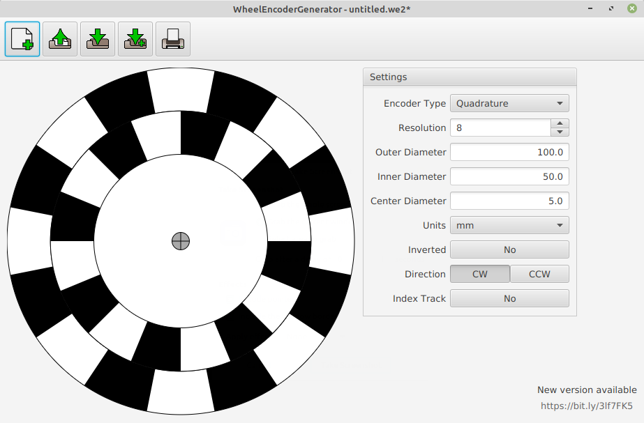

#WheelEncoderGenerator: User Guide

So, you'd like to design and print your own custom wheel encoders? WheelEncoderGenerator (WEG) can help! Let's get started.

## Installation
 * Download the latest version of WEG [here](https://github.com/shimniok/WheelEncoderGenerator/releases)
 * Extract archive to a location of your choosing
 * Open the extracted folder and open the ```bin``` folder/directory
 * Linux/Mac: open/run the file ```weg```
 * Windows: open/run the file ```weg.bat```

## Walkthrough

After you launch the application you should see this:



To make changes to your encoder design, you'll use the controls under the `Settings` pane on the right. 

###First, what kind of encoder do you want?

Make your selection in the `Encoder Type` pulldown menu.


You have these options:

 * **Quadrature**: used to detect forward/reverse motion
 * **Simple**: detects motion, cannot distinguish between forward/reverse
 * **Binary**: detects motion and absolute position
 * **Gray**: same as binary, except only one bit changes at a time
 
 For more details on these encoder types, see Encoder Reference

### Now specify the encoder resolution

Specify the encoder resolution in the `Resolution` field.

**Quadrature and Simple types:** the resolution corresponds to the number of black stripes on the outer track. For example, a resolution of `1` has one (1) black and one (1) white stripe while a resolution of `16` has sixteen (16) black stripes and sixteen (16) white stripes. An encoder with a resolution of `360` would detect down to 1 degree of rotation.
**Binary and Gray types:** the resolution corresponds to the number of tracks on the encoder and the number of unique positions the encoder can detect is equal to **2<sup>r</sup>** where **r** is resolution. So an encoder with a resolution of 4 (bits) has 16 unique positions.

### What units of measurement do you want to use?

You can select `mm` or `inches` from the `Units` pulldown menu.
 
### Next, what size do you want your encoder to be?

**Outer Diameter**. You can specify the outer diameter of the encoder disc in the`Outer Diameter` field.

**Inner Diameter**. The `Inner Diameter` field refers to the inner diameter of the innermost encoder track.

**Center Diameter**. Your encoder has to be mounted on some kind of shaft or axle, and so it needs a hole in the center. Specify the diameter of this axle shaft hole with the `Center Diameter` field.

### Inverted or not?

Click the `Inverted` toggle to swap the black and white colors on your encoder design.

### Clockwise or Counter-clockwise?

This setting doesn't make sense for a Simple encoder, so it is disabled for that type.

You can specify the direction your encoder rotation by clicking the `CW`(clockwise) or `CCW` (counter-clockwise) buttons next to the `Direction` label.

Why is this useful? Suppose you have an autonomous RC car. Each wheel encoder rotates in opposite directions. For each to generate the same signal pattern (and thus use the same code), one wheel has to be designed for clockwise and the other for counter-clockwise rotation.

In this case, after designing an encoder for the left side (American driver's side) to rotate clockwise, click the `CW` button, print it. For the right (Amercan passenger's side) wheel, simply click the `CCW` button and print the encoder again.

### Finally, do you want an index track?

This setting only makes sense for Quadrature and Simple encoders and is disabled for the Binary and Gray encoders.

The purpose of an index track is to identify a starting point in rotation. The index track has only one black stripe, of the same angular size as the stripes on the outer track.

### Save your work

To save your encoder, click the `Save` button. If it's the first time you've saved the encoder, a dialog will open and you'll be prompted for a file location and file name and you'll need to click the `Save` button on the dialog window.

If you've already saved the file previously, clicking the `Save` button will simply save the file.

How do you know if your encoder design has changed since last saved or opened? Look at the title bar. If the filename has a '*' following it, then the most recent changes have *not* been saved.

### Time to print your encoder


### Open a previously saved encoder file


### Save the current encoder into a new file


### Create a new encoder


